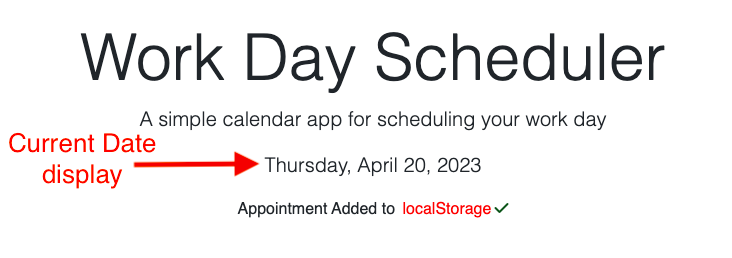
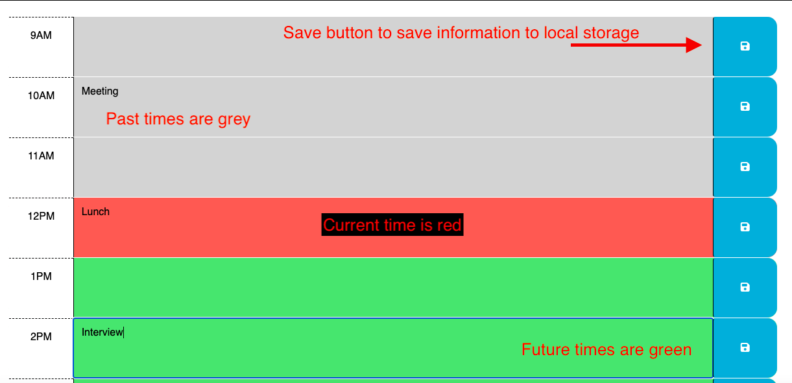

# module-five-challenge
Work Day Scheduler

src="https://bajones22.github.io/work-day-scheduler/"

## Description

The goal of this project was to create a functional work day scheduler. 

## Installation

N/A

## Usage

The usage of this work day scheduler is a simple web application where a user has the ability to type plans for their workday and hit the save button to save those plans into the local storage. The work day is broken into 9 hour blocks that are color coordinated to represent time that is past, present and future. The webpage automatically refreshes the time every minute to change the colors accordingly. 

## Credits

The original code originated from the following link: src="https://github.com/coding-boot-camp/crispy-octo-meme"

Referenced the following link for local storage: src="https://stackoverflow.com/questions/73565932/i-have-added-a-local-storage-function-but-it-doesnt-seem-to-work-on-my-scheduler"

## License

Please refer to the license in the repo
